<div align="center">


# 🎵 Booming Music

### Modern design. Pure sound. Fully yours.

[](https://github.com/mardous/BoomingMusic/releases/latest)
[](https://f-droid.org/packages/com.mardous.booming/)
[](https://github.com/mardous/BoomingMusic/releases)
[](LICENSE.txt)
[](CODE_OF_CONDUCT.md)
[](https://t.me/mardousdev)

<a href="https://github.com/mardous/BoomingMusic/releases"></a>
<a href="https://f-droid.org/packages/com.mardous.booming/"></a>
<a href="https://apt.izzysoft.de/packages/com.mardous.booming/"></a>
<a href="https://www.openapk.net/boomingmusic/com.mardous.booming/"></a>
<a href="https://apps.obtainium.imranr.dev/redirect?r=obtainium://add/https://github.com/mardous/BoomingMusic/"></a>

</div>

## 🗂️ Table of Contents

- [✨ Key Features](#-key-features)
- [📸 Screenshots](#-screenshots)
- [💻 Tech Stack](#-tech-stack)
- [🧩 Roadmap](#-roadmap)
- [🔗 Useful Links](#-useful-links)
- [🤝 Contributing](#-contributing)
- [🙌 Credits](#-credits)
- [⚖️ License](#-license)

## ✨ Key Features

- 🎼 **Automatic Lyrics Download & Editing** – Automatically fetch, sync, and edit lyrics with ease.
- 💬 **Word-by-Word Synced Lyrics** – Enjoy immersive real-time lyric playback with word-level timing.
- 🌍 **Translated Lyrics Support** – Display dual-language lyrics via TTML or LRC with translations.
- 🔊 **Built-in Equalizer** – Powerful EQ with up to 15 fully configurable bands and customizable profiles.
- 🎧 **AutoEq Support** – Import professionally tuned headphone correction profiles for the most accurate sound possible.
- 🔄 **Gapless Playback** – Smooth transitions between songs with zero interruption.
- 🧠 **Smart Playlists** – Auto-generated lists like *Recently Played*, *Most Played*, and *History*.
- 📈 **Native Scrobbling** – Seamlessly sync your listening history with **Last.fm** and **ListenBrainz**.
- 🎧 **Bluetooth & Headset Controls** – Manage playback easily via connected devices.
- 🚗 **Android Auto Integration** – Full hands-free experience on the road.
- 🎨 **Material You Design** – Dynamic theming for a modern and personal interface.
- 📂 **Folder Browsing** – Play songs directly from any folder.
- ⏰ **Sleep Timer** – Automatically stop playback after a set time.
- 🧩 **Widgets** – Lock screen and home screen controls for quick access.
- 🔖 **Tag Editor** – Edit song metadata such as title, artist, and album info.
- 🔉 **ReplayGain Support** – Maintain consistent volume across all tracks.
- 🖼️ **Automatic Artist Images** – Download artist artwork for a polished library look.
- 🚫 **Library Filtering** – Easily exclude or include folders with blacklist/whitelist options.

## 📸 Screenshots

<div align="center">
<table>
<tr>
<td align="center" width="25%">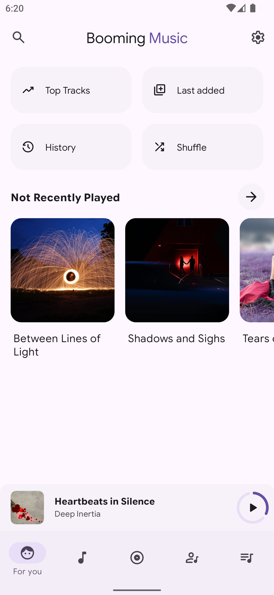</td>
<td align="center" width="25%">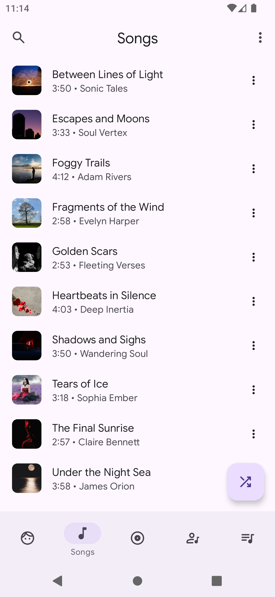</td>
<td align="center" width="25%">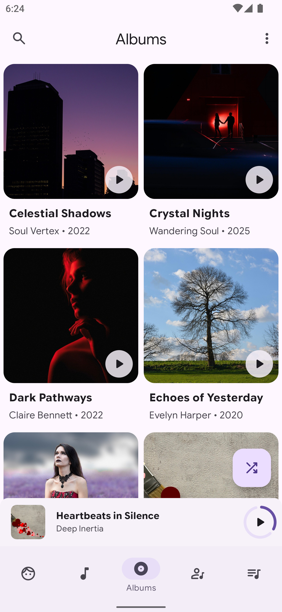</td>
<td align="center" width="25%">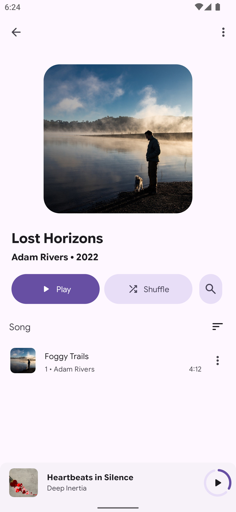</td>
</tr>
<tr>
<td align="center" width="25%">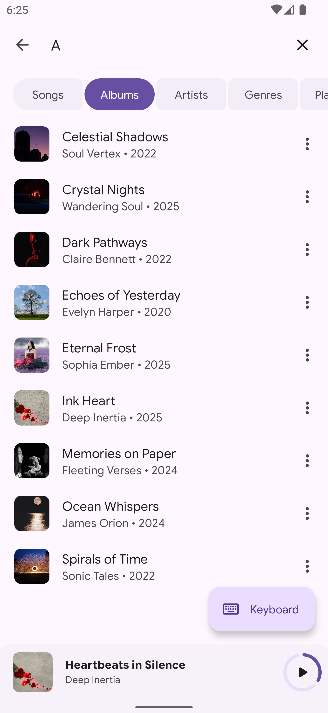</td>
<td align="center" width="25%">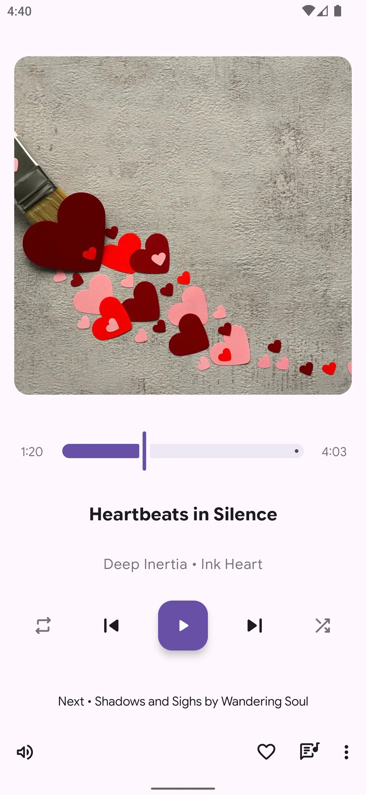</td>
<td align="center" width="25%">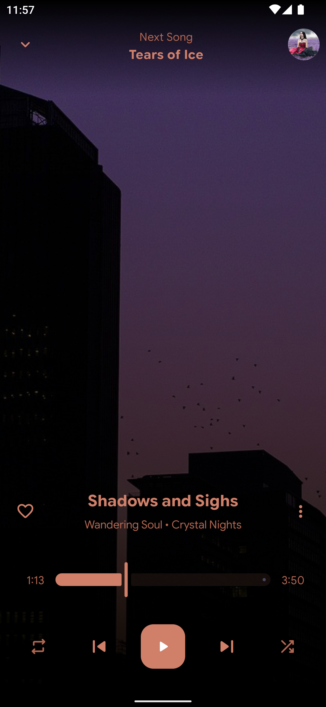</td>
<td align="center" width="25%">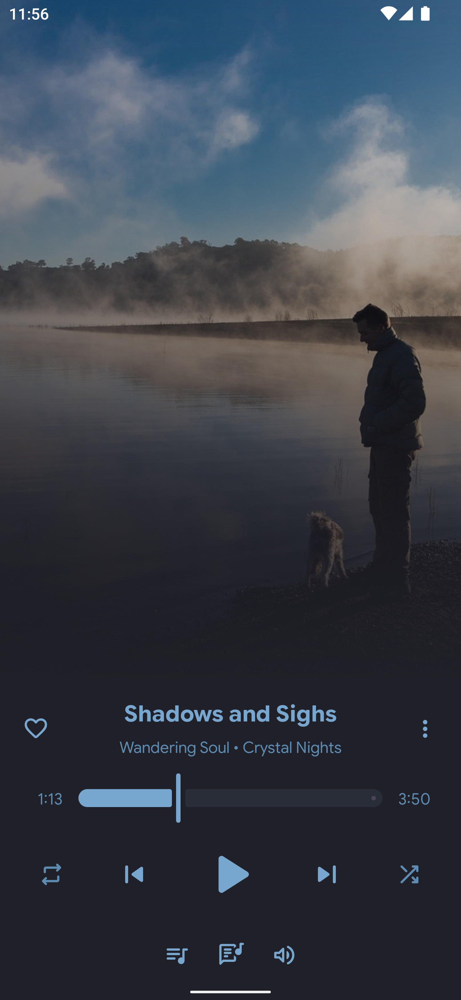</td>
</tr>
<tr>
<td align="center" width="25%">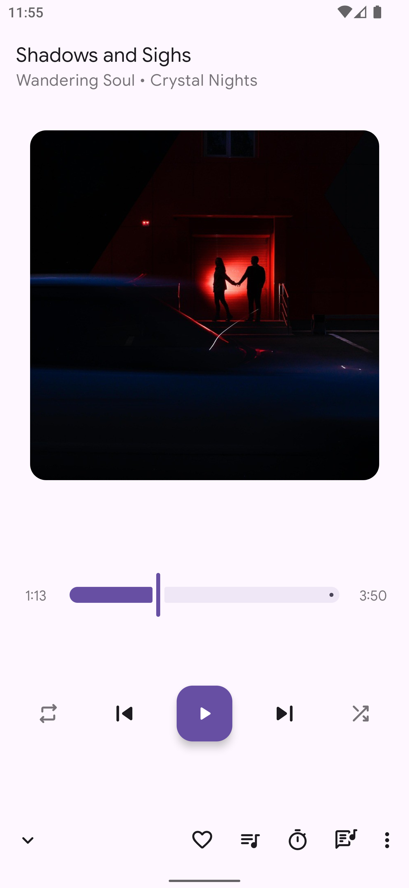</td>
<td align="center" width="25%">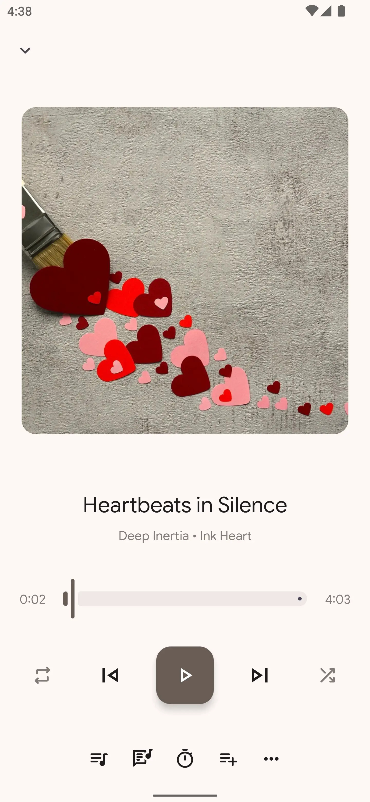</td>
<td align="center" width="25%">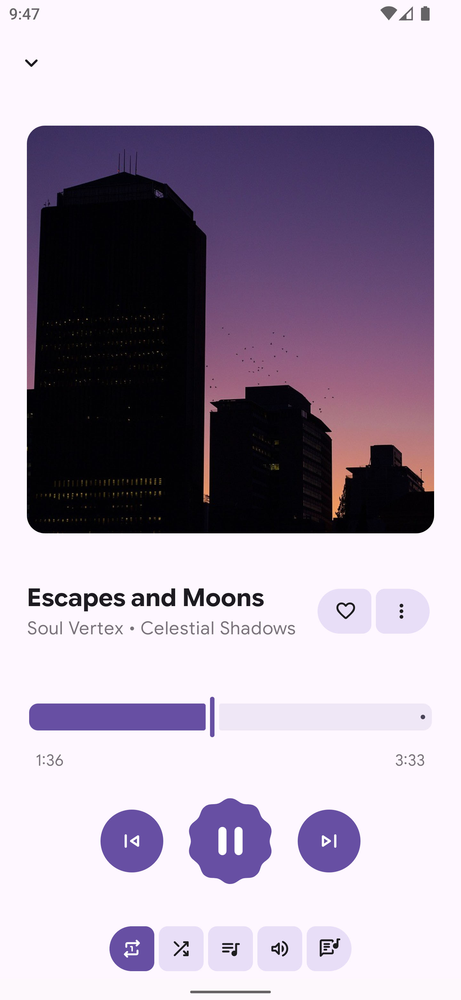</td>
<td align="center" width="25%">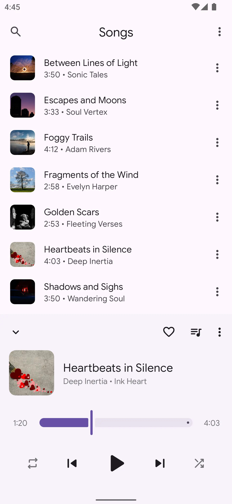</td>
</tr>
</table>
</div>

### 💻 Tech Stack

| Layer                   | Technology                                                     |
|:------------------------|:---------------------------------------------------------------|
| 🎧 Audio Engine         | [Media3 ExoPlayer](https://developer.android.com/media/media3) |
| 🧱 Architecture         | MVVM + Repository Pattern                                      |
| 💾 Persistence          | Room Database                                                  |
| ⚙️ Dependency Injection | [Koin](https://insert-koin.io/)                                |
| 🧵 Async                | Kotlin Coroutines & Flow                                       |
| 🧩 UI                   | Android Views + Jetpack Compose (hybrid)                       |
| 🖼️ Image Loading        | [Coil](https://coil-kt.github.io/coil/)                        |
| 🎨 Design               | Material 3 / Material You                                      |
| 🗣️ Language            | Kotlin                                                         |

## 🧩 Roadmap

- [ ] 📦 Independent library scanner (no MediaStore dependency)
- [ ] 🎨 Multi-artist support (split & index properly)
- [ ] 🎵 Improved genre handling
- [ ] 🔁 Last.fm integration (import/export playback data)
- [ ] 💿 Enhanced artist pages (separate albums and singles visually)
- [ ] 🌐 Jellyfin & Navidrome integration

## 🔗 Useful Links

- 🔐 **[Requested Permissions](https://github.com/mardous/BoomingMusic/wiki/Advanced-Info#-permissions)**  
  What the app needs and why

- 🚘 **[Android Auto Setup](https://github.com/mardous/BoomingMusic/wiki/Advanced-Info#-android-auto-setup)**  
  How to enable and troubleshoot

- 🎧 **[Supported Formats](https://github.com/mardous/BoomingMusic/wiki/Advanced-Info#-supported-formats)**  
  Compatible audio formats

- 💬 **[Community](https://github.com/mardous/BoomingMusic/wiki/Community)**  
  Users and contributors

- 🌐 **[Translations](https://hosted.weblate.org/projects/booming-music/)**  
  Help us translate Booming Music into your language

- ❓ **[FAQ](https://github.com/mardous/BoomingMusic/wiki/FAQ)**  
  Common questions

## 🤝 Contributing

Booming Music is open-source — contributions are **always welcome!**
Check the [Contributing Guide](CONTRIBUTING.md) for details.

If you enjoy the app or want to support its development, give the repo a ⭐ — it really helps!
You can also:
- Open issues
- Submit pull requests
- Suggest new ideas

**Translations:** Managed on [Hosted Weblate](https://hosted.weblate.org/projects/booming-music/).

[](https://hosted.weblate.org/projects/booming-music/)

## 💖 Support Development

Booming Music is an open-source project developed and maintained with passion in my spare time.
If you enjoy the app and the free features it offers, please consider supporting me to help cover
development costs and dedicate more time to new features.

Your support is greatly appreciated and keeps me motivated to continue improving Booming Music!

<div align="center">

<a href="https://ko-fi.com/christiaam" target="_blank">

</a>

### ❤️ Supporters

**mbeezy** (first donor)
<br/>
**[KKTweex](https://github.com/Qoojoe)**
<br/>
**[FabiRich](https://github.com/FabiRich)**
<br/>
**[Bloodaxe](https://github.com/Bloodaxe95)**
<br/>
**Bernhard**

</div>

## 🙌 Credits

Inspired by [Retro Music Player](https://github.com/RetroMusicPlayer/RetroMusicPlayer).
Also thanks to:

- [AMLV](https://github.com/dokar3/amlv)
- [LRCLib](https://lrclib.net/)
- [Better Lyrics](https://better-lyrics.boidu.dev/)
- [Lyrically API](https://lyrics.paxsenix.org/) (by [Alex](https://github.com/Paxsenix0))

## ⚖️ License

```
GNU General Public License - Version 3

Copyright (C) 2025 Christians Martínez Alvarado

This program is free software: you can redistribute it and/or modify
it under the terms of the GNU General Public License as published by
the Free Software Foundation, either version 3 of the License, or
(at your option) any later version.

This program is distributed in the hope that it will be useful,
but WITHOUT ANY WARRANTY; without even the implied warranty of
MERCHANTABILITY or FITNESS FOR A PARTICULAR PURPOSE.  See the
GNU General Public License for more details.

You should have received a copy of the GNU General Public License
along with this program.  If not, see <http://www.gnu.org/licenses/>.
```

---

<p align="center"><a href="#readme">⬆️ Back to top</a></p>
